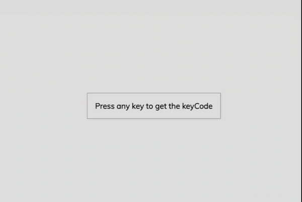

# Keyboard Event Project

This is a project that allows users to generate key, keycode, and code of any key they press on their keyboard. The project is built using HTML, CSS, and JavaScript.

## How to use the project

1. Clone the repository or download the zip file to your local machine.
2. Navigate to the project directory and open the index.html file in your preferred browser.
3. Click on the input box provided on the webpage.
4. Press any key on your keyboard.
5. The webpage will display the key, keycode, and code of the key you pressed.

## Code structure

The project is structured as follows:

- **index.html**: This is the main webpage of the project. It contains an input box where users can press any key on their keyboard.
- **style.css**: This file contains the styling for the webpage.
- **script.js**: This file contains the JavaScript code that listens for key events and displays the key, keycode, and code of the pressed key.
